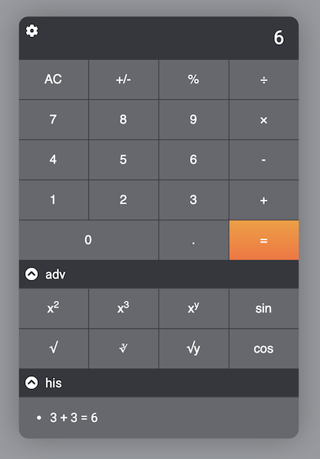

# Javascript Calculator



## Installation

Clone the repository
```
git clone git@github.com:gunharth/javascript-calculator.git
````
cd into the directory
```
cd javascript-calculator
````
Install all dependencies. This also installs all dependencies for web and api
```
npm install
```
Start and open the frontend on localhost:3000. Start the backend on localhost:3001.
```
npm start
```

## Development
### Frontend

cd into the directory web
```
cd web
````
Compile src/app.js and src/app.scss to the public folder
```
npm run dev
```
Automatically listen for code changes and re-compile with
```
npm run watch
```
Compile and minify all assets for production
```
npm run prod
```

## Features
- separation of front-end (web folder) and back-end (api folder)
- basic and a couple of advanced calculations
- various front-end layouts
- history of calculations is shown in front-end (non-persistent)
- history of calculations is saved on the server side under api/calculations.txt
- front end settings (theme, size, adv, his) are saved to local storage
- uses jQuery
- sass setup with normalize.css, fontawesome and Google Roboto font.
- uses Laravel-Mix for compilation and minification to web/public
- calculations are performed by the nodejs/express api server through json post requests
- keyboard support 
- replaced native Math functions with decimal.js
